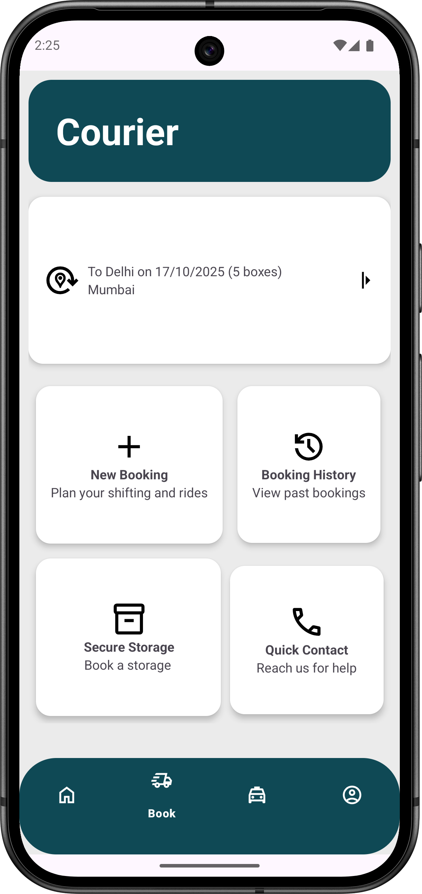
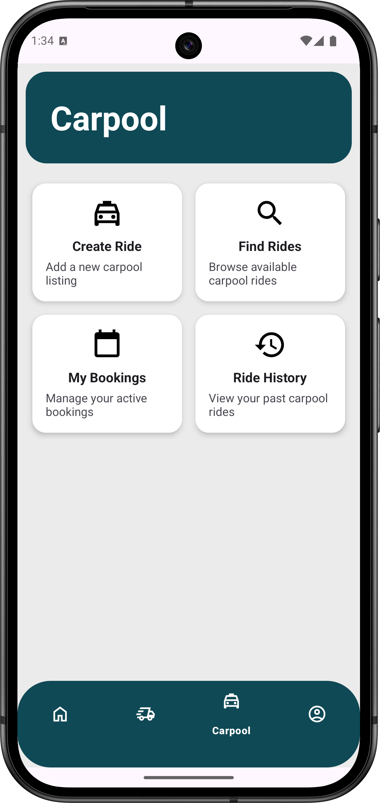
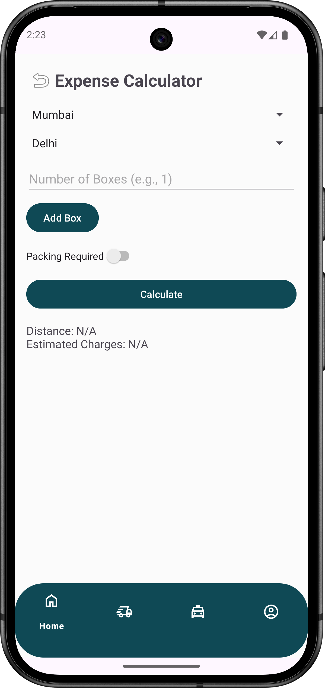
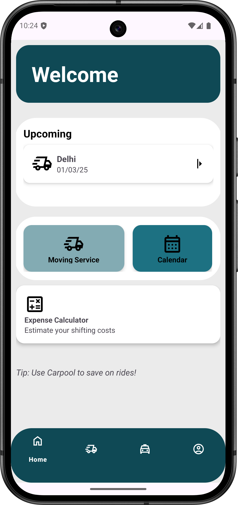

# 📦 Shift Semester — Student Logistics Made Simple

> 🚚 **Seamless | Affordable | Student-Centric**

**Shift Semester** is a concept Android app designed to make logistics effortless and budget-friendly for students.  
Built as a **prototype using Java, Jetpack Navigation, and Material Design**, it provides a unified platform to **book courier services, manage carpools, and estimate shifting expenses** — all in one place.

<p align="center">

</p>


---

## 🌟 Overview

Students often face logistical hurdles while moving between hostels, dorms, or apartments. **Shift Semester** bridges that gap by simplifying courier bookings and group carpools, tailored specifically for the student community.

This app prototype demonstrates how an intuitive, student-first design can make shifting more organized, cost-efficient, and eco-friendly.

> 💡 Example: A student moving from Delhi to Mumbai can use Shift to book a courier, share a carpool with peers, and estimate the total cost — all through a clean, easy-to-use interface.

---

## 🧭 Features

### 🚚 Streamlined Booking
Book a courier in minutes with the `newBookingFragment`.  
- Enter **Source**, **Destination**, **Date**, and **Number of Boxes**  
- Ready for integration with payment gateways like **Stripe**  



---

### 🚗 Carpool Feature
The `CarpoolFragment`, powered by `CarpoolFeature.java`, allows users to:
- Create or join shared rides for shifting or commuting  
- Reduce costs and carbon footprint  
- Perfect for **students moving together or sharing rides to campus**



---

### 💰 Expense Calculator
A simple **ExpenseCalculatorFragment** lets users:
- Estimate courier costs  
- Budget effectively before booking  
- Ideal for **cost-conscious students**



---

### 👤 Account Management
Integrated with **Firebase Authentication**:
- Sign up, log in, and manage profiles  
- Update display name and view account info  
- Secure sign-out flow  

---

### 🏠 Smart Home Dashboard
Dynamic **HomeFragment** provides:
- Randomized helpful tips  
- Quick navigation to courier booking, calendar, and expense tools  
- Smooth integration with **BottomNavigationView**



---

## 🛠️ Tech Stack

| Component | Technology Used |
|------------|----------------|
| **Language** | Java |
| **Architecture** | Android Fragments + Navigation Components |
| **UI Design** | Material Design Components |
| **Backend/Auth** | Firebase Authentication |
| **Database** | Firebase (Auth only in prototype) |
| **IDE** | Android Studio |
| **Other APIs** | Calendar Intent API |

---

## 🧩 Code Structure
```
com.example.shift/
├── MainActivity.java
├── HomeFragment.java
├── BookFragment.java
├── newBookingFragment.java
├── AccountFragment.java
├── model/
│   └── CarpoolFeature.java
└── res/
    ├── layout/
    │   ├── fragment_home.xml
    │   ├── fragment_book.xml
    │   ├── fragment_new_booking.xml
    │   ├── fragment_account.xml
    │   └── activity_main.xml
    └── navigation/
        └── main_nav.xml
```


---

## 👨‍💻 Author
## Parv Shrivastava
## 📧 [parv2410shri@gmail.com]


